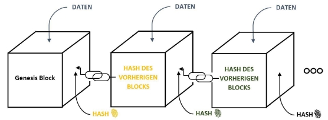
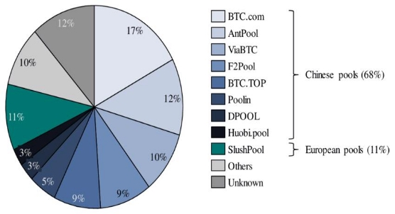
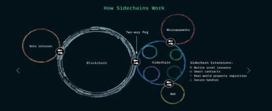

Fachhochschule Aachen Campus Jülich

Medizintechnik und Technomathematik Angewandte Mathematik und Informatik

**Blockchain- Technologie : Analyse**

**von Proof of Work (Bitcoin)**

**Seminararbeit von Ziad Bougrine**

Jülich, März 2023

Diese Arbeit ist von mir selbständig angefertigt und verfasst. Es sind keine anderen als![ref1] die angegebenen Quellen und Hilfsmittel benutzt worden.

Ziad Bougrine ...........................................

Diese Arbeit wurde betreut von:

1. **Prüfer :** Prof. Dr. rer. nat. Volker Sander
2. **Prüfer :** M. Sc. Lukas Walk

ii Z.Bougrine: Blockchain- Technologie : Analyse von Proof of Work (Bitcoin),24. März 2023![ref2]

**Abstrakt**

Dieser Bericht liefert eine umfassende Analyse der Technologie von Blockchain-Netzwerken und Kryptowährungen, die auf Proof-of-Work basieren. Es wird detailliert auf die Funk- tionsweise von Kryptowährungen eingegangen und hervorgehoben, wie ihre dezentrale Struktur sichere und transparente Transaktionen ermöglicht.

Proof of Work ist ein beliebter Konsensmechanismus in der Blockchain-Technologie und wird von mehreren Kryptowährungen wie Bitcoin verwendet. Der Bericht diskutiert auch die Schwierigkeiten bei Proof of Work und erörtert, wie es angepasst werden kann.

Darüber hinaus befasst sich der Bericht mit den Zukunftsaussichten dieser Technologien und betont das Potenzial der Blockchain-Technologie, die Art und Weise, wie wir Trans- aktionen durchführen und Daten speichern, grundlegend zu verändern. Neben Proof-of- Work und anderen Konsensmechanismen werden auch Sidechains und ihre Funktionweise untersucht, wobei betont wird, dass Sidechains die Skalierbarkeit und Interoperabilität von Blockchains verbessern können.

Mögliche Blockchain-Angriffe wie 51%-Angriffe, Routerangriffe, Sybil-Angriffe und Dou- blespending werden ebenfalls erörtert, um ein vollständiges Verständnis der Sicherheits- aspekte von Blockchain-Netzwerken zu vermitteln.

Insgesamt bietet dieser Bericht einen detaillierten Einblick in die verschiedenen Aspekte der Blockchain-Technologie und zeigt auf, wie sich diese in Zukunft auf unser tägliches Leben auswirken könnte.

iii

**Inhaltsverzeichnis**

**Abstrakt iii 1 Einleitung 1**

**2 Einführung in die Blockchain 3**

1. Blockchain Definition . . . . . . . . . . . . . . . . . . . . . . . . . . . . . . 3
1. Konstruktion des Blocks . . . . . . . . . . . . . . . . . . . . . . . . . . . . 4

2\.2.0.1 Die Definition von Merkle-Bäumen . . . . . . . . . . . . . 5

3. Blockchaining-Mechanismus . . . . . . . . . . . . . . . . . . . . . . . . . . 5
4. Sicherung der Unveränderlichkeit und Zensurresistenz in Blockchain-Technologie 6
1. Konsensmechanismus . . . . . . . . . . . . . . . . . . . . . . . . . . 6
1. Kryptographische Methoden zur Datensicherung auf der Blockchain 6
1. Dezentralisierung . . . . . . . . . . . . . . . . . . . . . . . . . . . . 6
1. Die Rolle von Mehrfachkopien bei der Datensicherung auf der

Blockchain . . . . . . . . . . . . . . . . . . . . . . . . . . . . . . . 6

5. Effizientes Mining durch Pooling: Eine Einführung in Mining-Pools . . . . 7

**3 Theoretische Seite der Proof-Of-Work-Methode 9**

1. Einführung in die Proof-of-Work-Methode . . . . . . . . . . . . . . . . . . 9
1. Die Bedeutung der Methode in der Blockchain-Technologie . . . . 9
1. Proof-of-Work in der Blockchain-Technologie: Vorzüge und Emp- fehlungen für eine effektive Anwendung . . . . . . . . . . . . . . . 9
1. Sicherheit der Dezentralisierung im Proof-of-Work-Protokoll . . . . 10
1. Verbesserung der Dezentralisierung im Proof-of-Work-Protokoll . . 10
2. Proof-of-Work-Berechnungen in der Blockchain-Technologie . . . . . . . . 10
1. Diese beschreiben den Prozess einer Transaktion im Blockchain- Netzwerk. . . . . . . . . . . . . . . . . . . . . . . . . . . . 11
1. Dies ist ein sequentielles Diagramm, das erklärt, wie es funktioniert . . . . . . . . . . . . . . . . . . . . . . . . . . 11
3. Praktische Anwendung der Proof-Of-Work-Methode . . . . . . . . . . . . 13
4. Vor- und Nachteile von Proof-Of-Work . . . . . . . . . . . . . . . . . . . . 17

**4 Schwierigkeit und Sicherheit des Proof-Of-Work 21**

1. Die Bedeutung der Schwierigkeit im Proof-of-Work-Protokoll . . . . . . . 21
1. Schwierigkeitsanpassung im Proof-of-Work-Protokoll der Blockchain-Technologie 21
1. Auswirkungen einer zu niedrigen Schwierigkeitseinstellung im Proof- of-Work-Protokoll . . . . . . . . . . . . . . . . . . . . . . . . . . . 22

v

**Inhaltsverzeichnis**

2. Auswirkungen von Schwierigkeitsgrad und Netzwerkgröße auf die Sicherheit und Integrität der Blockchain-Technologie im Proof-of- Work-Protokoll . . . . . . . . . . . . . . . . . . . . . . . . . . . . . 22

**5 Sidechains 23**

1. Sidechain : Eine Analyse der Definition und Eigenschaften . . . . . . . . . 23
1. Definition von Sidechain . . . . . . . . . . . . . . . . . . . . . . . . 23
1. Sidechain, auf die Proof-Of-Work basieren . . . . . . . . . . . . . . 24
1. Eigenschaften . . . . . . . . . . . . . . . . . . . . . . . . . . . . . . 24
2. Two-way peg . . . . . . . . . . . . . . . . . . . . . . . . . . . . . . . . . . 25
3. Intelligente Verträge . . . . . . . . . . . . . . . . . . . . . . . . . . . . . . 26
3. Sidechain bei Bitcoin . . . . . . . . . . . . . . . . . . . . . . . . . . . . . . 27

5\.4.0.1 Prozess der Sidechain bei Proof of work . . . . . . . . . . 27

5. Unterscheidung von Mainchain und Sidechain in der Blockchain-Technologie 28

**6 Angriffszenarien in der Blockchain-Technologie 29**

1. Sybil-Angriff . . . . . . . . . . . . . . . . . . . . . . . . . . . . . . . . . . 29
1. Sybil-Angriff: Eine Analyse der Definition und Eigenschaften . . . 29
1. Die Funktionsweise dieses Angriffs . . . . . . . . . . . . . 29
1. Ablauf eines Sybil-Angriffs . . . . . . . . . . . . . . . . . 30
2. Die Sicherheit in der Blockchain-Technologie gegen Sybil-Attacken 30
1. Identitätsüberprüfung . . . . . . . . . . . . . . . . . . . . 30
1. Soziale Vertrauensdiagramme . . . . . . . . . . . . . . . . 30
1. Wirtschaftliche Kosten . . . . . . . . . . . . . . . . . . . 31
1. Validierung der Personalität . . . . . . . . . . . . . . . . 31
2. Doublespending . . . . . . . . . . . . . . . . . . . . . . . . . . . . . . . . . 31
1. Doublespending: Eine Analyse der Definition und Eigenschaften . 31

6\.2.1.1 Die Funktionsweise dieses Angriffs . . . . . . . . . . . . . 31

2. Sicherheitsmechanismen der Blockchain-Technologie bei Proof-of-

Work gegen Double-Spending-Angriffe . . . . . . . . . . . . . . . . 31

3. 51% Angriff . . . . . . . . . . . . . . . . . . . . . . . . . . . . . . . . . . . 32
1. 51%-Angriff:Eine Analyse der Definition und Eigenschaften . . . . 32

6\.3.1.1 Die Funktionsweise dieses Angriffs . . . . . . . . . . . . . 32

2. Auswirkungen eines 51%-Angriffs auf Sicherheit, Integrität und Vertrauen in Netzwerken . . . . . . . . . . . . . . . . . . . . . . . 32
3. Erkennung eines 51%-Angriffs in der Blockchain-Technologie . . . 33
3. Die Grenzen des 51%-Angriffs . . . . . . . . . . . . . . . . . . . . . 33
3. Prävention von 51%-Angriffen in der Blockchain-Technologie . . . 33
4. Routing Angriff . . . . . . . . . . . . . . . . . . . . . . . . . . . . . . . . . 34 **7 Schluss 35 Literaturverzeichnis 37**

vi Z.Bougrine: Blockchain- Technologie : Analyse von Proof of Work (Bitcoin),24. März 2023![ref2]

**Abbildungsverzeichnis**

1. Ein Beispiel für eine Blockchain-Kette . . . . . . . . . . . . . . . . . . . . 3
1. Der erste Block der Kette wird als Genius-Block bezeichnet. . . . . . . . . 5
1. Die echten Blockchain-Block-Transaktionen. . . . . . . . . . . . . . . . . . 14
1. Klassendiagram . . . . . . . . . . . . . . . . . . . . . . . . . . . . . . . . . 15
1. Activity Diagram . . . . . . . . . . . . . . . . . . . . . . . . . . . . . . . . 16
1. Die heutige Schwierigkeit ist . . . . . . . . . . . . . . . . . . . . . . . . . . 18
1. Mechanismus der Sidechain . . . . . . . . . . . . . . . . . . . . . . . . . . 25
1. Two way peg . . . . . . . . . . . . . . . . . . . . . . . . . . . . . . . . . . 25
1. Intelligente Verträge . . . . . . . . . . . . . . . . . . . . . . . . . . . . . . 27

vii

**1 Einleitung**

Blockchain ist seit den späten 2000er Jahren eine der wichtigsten Technologien im Be- reich digitaler Transaktionen. Im Jahr 2008 veröffentlichte eine Person oder Gruppe von Personen unter dem Namen Satoshi Nakamoto ein Whitepaper mit dem Titel ”Bitcoin: A Peer-to-Peer Electronic Cash System”, [ Die Quelle des Whitepapers ist [ 17 ] ]”. Vier Monate später, am 3. Januar 2009, wurde der Genesis-Block erstellt, der den Beginn und Tag 0 des Bitcoin- und Blockchain-Netzwerks markierte. Die Blockchain wurde entwi- ckelt, um als öffentliches Hauptbuch für Bitcoin-Transaktionen zu dienen und basiert auf der Proof-of-Work-Methode, um die Schaffung und den Handel von Bitcoin und anderen Kryptowährungen während der Finanzkrise 2007/08 zu unterstützen. Heutzutage gibt es viele Kryptowährungen wie Litecoin (2011), Ethereum (2015) und Dogecoin (2013).

Die Implementierung der Blockchain in Bitcoin machte es zur ersten digitalen Währung, die das Problem der doppelten Ausgaben ohne die Notwendigkeit einer vertrauenswür- digen zentralen Behörde löst. Einer der Hauptvorteile von Blockchain ist, dass jeder erstellte Block, der einen Datensatz enthält, unveränderlich ist und seine Authentizi- tät von der gesamten Gemeinschaft autorisierter Benutzer und nicht von einer einzigen zentralen Behörde überprüft werden kann. Das System ist daher darauf ausgelegt, die Transparenz und Rechenschaftspflicht von digitalisierten Transaktionen zu verbessern. Ein Beispiel: Stellen Sie sich ein Transaktionsbanksystem vor, das von einem Server oder Systemadministrator verwaltet wird. Dies könnte die Wartung des Systems, das Verwalten, Löschen und Hinzufügen von Benutzer- oder Transaktionsinformationen zur Datenbank umfassen. Es könnte auch bedeuten, dass der Administrator behauptet, dass Sie ihm 10.000 € schulden, was gefährlich ist. Das ist der Grund, warum die Blockchain- Technologie erfunden wurde. Indem es immer für alle sichtbar im Hauptbuch aufge- zeichnet wird, wenn Geld von einem Konto auf ein anderes überwiesen wird, kann jeder Benutzer die Transaktion überprüfen und sicherstellen, dass sie korrekt und legitim ist.

1

**2 Einführung in die Blockchain**

1. **Blockchain Definition**

Die **Blockchain** ist eine ständig wachsende Liste von Datensätzen, die in einzelnen Blö- cken organisiert sind. Sie dient als öffentliches Hauptbuch, in dem Personen Datensätze einsehen und erstellen können. Jeder Block besteht aus Daten, einem Hash, dem Hash des vorherigen Blocks und einem Zeitstempel. Das Wesentliche an der Blockchain ist, dass wir spätere Transaktionen auf früheren Transaktionen aufbauen und deren Richtig- keit bestätigen können, indem wir die Kenntnis der früheren Transaktionen nachweisen. Auf diese Weise wird es unmöglich gemacht, die Existenz oder den Inhalt früherer und späterer Transaktionen zu manipulieren. Andere Teilnehmer der dezentralen Buchhal- tung erkennen eine Manipulation der Blockchain an der Inkonsistenz der Blöcke. [ Die Informationen, die hier dargestellt wurden, wurden aus diesen beiden Artikeln entnom- men: [ 6 ] und [ 18 ] ]

Die **Blockchain** ist ein verteiltes Hauptbuch, das sich selbst reguliert, das heißt, dass es keine Person gibt, die Kontrolle oder Veränderungen vornehmen kann. Stattdessen tragen Tausende von Benutzern, die am Blockchain-Netzwerk teilnehmen, dazu bei, es funktionsfähig zu halten. Wenn eine Person versucht, das System zu betrügen, wird sie schnell als Betrugserkennung markiert, da das gesamte Netzwerk sie überprüft.

Abbildung 2.1: Ein Beispiel für eine Blockchain-Kette

[ 21 ]

3

2. **Konstruktion des Blocks**

Ein Block speichert Informationen über Transaktionen, Zeitstempel, vorherigen Hash, Block-Hash.

- **Magische Zahl :** Nummer, die diesen Block als Teil des Netzwerks einer bestimm- ten Kryptowährung identifiziert.
- **Transaktionen :** die Hauptinformationen und auch den größten Teil des Blocks
- **Transaktionszähler :** die Anzahl der im Block gespeicherten Transaktionen
- **Block Größe :** die maximale Größe der Informationen, die der Block enthält

Ein Block enthält viele Informationen, belegt jedoch nicht viel Speicherplatz. Nehmen wir diese Elemente als Beispiel: Was ist die Hauptinformationen, die ein Block (Trans- aktionen) enthält?

- **Version:** Sie ist benutzbar, um einen neuen Block zu erstellen und um eine neue Version von Software zu identifizieren. Es ist auf 4 Bytes (4 x 8 „bits“) codiert.
- **Vorheriger Block-Hash:** Enthält einen Hash des Headers des vorherigen Blocks (md5, sha256 ...). Es ist auf 32 Bytes (32 x 8 = 256 „bits“) codiert.
- **Hash Merkle root:** Hash of transactions in the Merkle tree of the current block. Es ist auf 32 Bytes (32 x 8 = 256 „bits“) codiert.
- **Time:** Erstellungszeit des Blocks. Es ist auf 32 Bytes (32 x 8 „bits“) codiert.
- **Bits:** Es ist ein Wert, der die Schwierigkeitsbewertung des Ziel-Hashes und die Schwierigkeit beim Lösen der „Nonce“ angibt. Es ist auf 32 Bytes (32 x 8 „bits“) codiert.
- **Nonce:** Es ist die magische Zahl, die der Miner lösen muss, um einen Block im Blockchain-Netzwerk zu verifizieren und zu schließen.

**Wichtige Anmerkung :** Die Miner setzen ihre Rechenleistung ein, um mithilfe von Zufallszahlen ( wie Bruteforce) die Nonce im Hash zu erraten. Sobald die Nonce erfolg- reich bestimmt wurde, wird der Hash verifiziert und der Block geschlossen. Anschließend wird ein neuer Block mit einem Header erstellt und der Prozess wiederholt sich. Die Non- ce ist von Interesse für Miner, da sie einen wichtigen Bestandteil des Mining-Prozesses darstellt, bei dem versucht wird, den Hash zu lösen.

3. **Blockchaining-Mechanismus![ref3]**

**2.2.0.1 Die Definition von Merkle-Bäumen**

Es handelt sich um eine Datenstruktur in Form eines Binärbaums, die in Bitcoin und Kryptowährung weit verbreitet ist und zur effizienten und sicheren Kodierung von Daten verwendet wird.

3. **Blockchaining-Mechanismus**

**Eine Blockchain funktioniert** ähnlich wie eine verkettete Liste, da sie aus einer Reihe von Blöcken besteht, die jeweils durch einen Hash des aktuellen Blocks und einen Hash des vorherigen Blocks miteinander verbunden sind. Dieser Mechanismus ermöglicht es, über die Kette zu iterieren, ähnlich wie bei einer verketteten Liste, bei der jeder Knoten einen Zeiger auf den vorherigen Knoten enthält.

Abbildung 2.2: Der erste Block der Kette wird als Genius-Block bezeichnet.

[ 16 ]

In solchen Fällen sollte man immer im Hinterkopf behalten, dass Hacker versuchen wer- den, viele Angriffe auf das Blockchain-Netzwerk zu entwerfen, z. B. die Änderung oder Manipulation der Daten in Block (i). Dies führt zu einer Änderung des tatsächlichen Blocks i und macht das Feld ”vorheriger Hashïn Block (i+1) ungültig. Das bedeutet, dass die Änderung eines Blocks alle nachfolgenden Blöcke in der Blockkette ungültig macht, was die Integrität der Kette beweist.

**Wichtige Anmerkung :** Die Verwendung von Hash reicht jedoch nicht aus, um ver- dächtige Manipulationen zu verhindern. Da Computer heute sehr schnell sind und Tau- sende von Hash-Operationen berechnen können, besteht technisch die Möglichkeit, einen Block zu manipulieren und alle Hashes der folgenden Blöcke neu zu berechnen, um das Netzwerk der Blockkette mit falschen Informationen wieder gültig zu machen. Aus die- sem Grund verwendet die Bitcoin-Blockchain einen Konsensmechanismus, der als Proof- Of-Work (PoW) bezeichnet wird, um das Problem der Neuberechnung von Blöcken zu lösen. [ Diese Informationen sind von diesem Artikel und Buch genommen. [ 13 ] und [ 11 ] ]

4. **Sicherung der Unveränderlichkeit und Zensurresistenz in Blockchain-Technologie**

Die Unveränderlichkeit und Zensurresistenz der Daten in einer Blockchain wird durch verschiedene Technologien und Mechanismen gewährleistet, darunter :

- Konsensmechanismus
- Kryptografie
- Dezentralisierung
- Mehrere Kopien
1. **Konsensmechanismus**

Konsensmechanismus: ist ein Mechanismus, der es allen Teilnehmern einer Blockchain ermöglicht, Mining-Operationen durchzuführen, was bedeutet, komplexe mathematische Operationen zu lösen, um einen Block zu validieren und ihn der Hauptkette hinzuzufü- gen. In unserem Bericht haben wir ausschließlich über PoW berichtet. Es gibt verschie- dene Beispiele dafür, z. B. ”Proof-of-Work”, ”Proof-of-Stake”oder ”Proof-of-Space”.

2. **Kryptographische Methoden zur Datensicherung auf der Blockchain**

Kryptografie: Die Blockchain-Technologie nutzt Kryptografie, um Daten zu verschlüsseln und mit Hash-Funktionen wie SHA256, die von PoW verwendet werden, zu signieren. Dadurch wird die Sicherheit der Daten in der Blockchain gewährleistet, da jede Änderung an einer Transaktion oder einem Block sofort erkannt wird.

3. **Dezentralisierung**

Dezentralisierung: Eine Blockchain ist ein dezentralisiertes Netzwerk, das viele verschie- dene Teilnehmer enthält. Das bedeutet, dass keine zentrale Behörde die Kontrolle über das Netzwerk hat, was es einer einzelnen böswilligen Person erschwert, die Daten zu verändern.

4. **Die Rolle von Mehrfachkopien bei der Datensicherung auf der Blockchain**

Mehrere Kopien: Die Blockchain speichert mehrere Kopien ihrer Daten bei vielen ver- schiedenen Teilnehmern, was bedeutet, dass es schwieriger ist, alle Kopien einer Block- kette zu zensieren.

Z.Bougrine: Blockchain- Technologie : Analyse von Proof of Work (Bitcoin),24. März 2023 5![ref4]

5. **Effizientes Mining durch Pooling: Eine Einführung in Mining-Pools![ref3]**

**2.5 Effizientes Mining durch Pooling: Eine Einführung in Mining-Pools**

Ein Mining-Pool ist eine Gruppe von Minern, die ihre Hardware kombinieren, um ih- re Chancen auf Belohnungen durch den Prozess des Minings von Kryptowährungen zu erhöhen, die auf dem Proof-of-Work (PoW)-Konsensmechanismus basieren. Die kryp- tografischen Rätsel, die gelöst werden müssen, um Belohnungen zu erhalten, sind für einzelne Miner oft zu komplex zu lösen, und das Poolen von Ressourcen ermöglicht ei- ne dynamischere Nutzung der Rechenleistung. Der Mining-Pool ist dafür verantwortlich, die Verteilung der Belohnungen unter seinen Teilnehmern zu verwalten, was in der Regel automatisch geschieht, je nachdem, wie viel jeder Miner zur Lösung beigetragen hat, um den Hash zu finden. Einige bekannte Mining-Pools im Jahr 2023 sind Antpool, BTCC Mining Pool und Slush Pool.

[ 20 ]

Z.Bougrine: Blockchain- Technologie : Analyse von Proof of Work (Bitcoin),24. März 2023 7![ref4]

**3 Einführung in die**

**„Proof-Of-Work“-Methode**

1. **Einführung in die Proof-of-Work-Methode**
1. **Die Bedeutung der Methode in der Blockchain-Technologie**

**Proof-Of-Work** ist eine dezentrale Konsensmethode ( Der Konsensmechanismus wurde bereits in diesem Abschnitt in Abschnitt 2.4.1 diskutiert.), bei der die Netzwerkteilneh- mer Rechenleistung geben müssen, um ein Hash zu finden. Dieser Prozess dient als Abschreckung gegen Manipulation oder Ausbeutung des Systems, weil die Teilnehmer (Nodes) Arbeit leisten müssen. Was es ein sicheres Mittel zur Überprüfung der Integrität von Transaktionen und zur Aufrechterhaltung des Konsenses zwischen allen Mitgliedern des Netzwerks bietet.

2. **Proof-of-Work in der Blockchain-Technologie: Vorzüge und Empfehlungen für eine effektive Anwendung**

**Proof-Of-Work (POW)** wurde entwickelt, um zu verhindern, dass Nutzer Blocks in der Blockchain leicht manipulieren. Es verlangt von Minern, eine signifikante Menge an Mühe aufzuwenden, um einen Block zu erstellen. Diese Methode basiert auf verschiede- nen Grundprinzipien in der Kryptowährung, wie folgt:

- **Der Proof-Of-Work-Mechanismus sorgt dafür**, dass das Hinzufügen von Blö- cken zur Blockchain-Kette mit einer gewissen Schwierigkeit verbunden ist, indem es Miner dazu zwingt, einen gültigen Hash zu finden. Diese Methode wurde so kon- zipiert, dass etwa alle zehn Minuten ein neuer Block mit einer festgelegten Menge an BTC in die Kette aufgenommen wird. Dies gewährleistet das algorithmische Wachstum der Geldmenge.
- **Die Verwendung von Proof-Of-Work** ermöglicht es den Nodes, die Integrität der Blockchain zu überprüfen, indem sie diejenige wählen, die den größten Aufwand in Form von Rechenleistung darstellt. Auf diese Weise ist es einfach zu erkennen, welche Blockchain die authentische ist.
- **Die Verwendung von Proof-Of-Work** dient dazu, das Blockchain-Netzwerk vor Angreifern zu schützen, da diese eine größere Energiemenge in das Netzwerk einspeisen müssten als alle anderen verfügbaren Miner insgesamt über einen län- geren Zeitraum. Dies ist beim Bitcoin aufgrund der enormen Rechenleistung, die benötigt wird, um einen gültigen Block zu erstellen, praktisch unmöglich.

9

3 **Theoretische Seite der Proof-Of-Work-Methode![ref1]**

- **Proof-Of-Work ist eine bewährte Methode** zur Sicherung von Blockchains und zur Neuverteilung von digitalen Währungen. Im Gegensatz zu Fiatgeld, das von Zentralbanken gedruckt werden kann, erfordert die Erschaffung von Währun- gen in einem Proof-Of-Work-System einen tatsächlichen Einsatz von Ressourcen. Dadurch wird ein fairer Mechanismus für die Verteilung von Währungen gewähr- leistet.

**Anmerkung :** Die Informationen in diesem Abschnitt stammen aus der Quelle [ 1 ].

3. **Sicherheit der Dezentralisierung im Proof-of-Work-Protokoll**

Die Dezentralität ( Die Dezentralisierung wurde bereits in diesem Abschnitt in Ab- schnitt 2.4.3 diskutiert. ) in dieser Methode ist abhängig von verschiedenen Faktoren, der Verteilung der Mining-Ressourcen und der Zentralisierung der Mining-Pools. Wenn eine hohe Konzentration unter den Mining-Pools besteht, kann das zu einer kleineren Dezentralisierung führen, denn ein einzelner Mining-Pool könnte in der Lage sein, die Mehrheit der Rechenleistung des Netzwerks zu kontrollieren.

4. **Verbesserung der Dezentralisierung im Proof-of-Work-Protokoll**

Es gibt oft Maßnahmen wie die Förderung einer gleichmäßigen Verteilung der Mining- Ressourcen und die Einführung von Mechanismen, die eine Zentralisierung der Mining- Pools einschränken, ergriffen. Dies trägt zu einer fairen Verteilung der Rechenleistung bei und unterstützt außerdem den Aufbau eines robuster und sichereren Netzwerks.

2. **Proof-of-Work-Berechnungen in der Blockchain-Technologie**

**Hash-Funktion** Zuerst muss man wissen, wie die Hash-Funktion funktioniert, indem sie

eine eindeutige, nicht invertierbare mathematische Funktion, die aus einer belie- bigen Eingabestring eine feste Länge erzeugt. Sie könnte eine beliebig lange Zei- chenfolge in eine eindeutige Zeichenfolge festgelegter Länge umwandeln. Beispiel hierfür ist der Einsatz der SHA-256-Hash-Funktion im Bereich des Minings.

**Mining** ist ein Prozess, bei dem Miner versuchen, die Nonce und die Reihenfolge von

jeden Parameter zu erraten, die von einer Hash-Funktion als Eingabe akzeptiert werden, um ein Ergebnis zu liefern. Da es unmöglich ist, die Hash-Funktion um- zukehren, um die ursprüngliche Eingabe zu erhalten, müssen Miner eine Vielzahl (Milliarden von Berechnungen) von Operationen durchführen, um den Wert der Eingabe für die Hash-Funktion zu ermitteln. Sobald ein solches Ergebnis erzielt wurde, wird den Minern eine Belohnung gewährt.

10  Z.Bougrine: Blockchain- Technologie : Analyse von Proof of Work (Bitcoin),24. März 2023![ref2]

2. **Proof-of-Work-Berechnungen in der Blockchain-Technologie**
1. **Diese beschreiben den Prozess einer Transaktion im Blockchain-Netzwerk.**
1. Die Blockchain generiert einen Block, der alle Transaktionen enthält, die in einem bestimmten Zeitraum stattgefunden haben.
1. Der Verifizierer wird die Integrität der Transaktionen überprüfen, um sicherzustel- len, dass sie legitim sind.
1. Die Miner im Netzwerk überprüfen dann die Legitimität dieser Transaktionen und führen anschließend eine Suche durch, indem sie die Nonce und die Reihenfolge von jeden Parameter erraten. Der erfolgreiche Miner, der als erstes die Lösung findet, wird mit einer Belohnung(Anzahl von Bitcoins) bekommen.
1. Das Blockchain-Netzwerk wird dann um den Block mit den bestätigten Transak- tionen erweitert und wird als Teil der Blockchain gespeichert.
1. Eine Transaktion wird als durchgeführt angesehen.
1. Der Prozess wird wiederholt
2. **Dies ist ein sequentielles Diagramm, das erklärt, wie es funktioniert**

Z.Bougrine: Blockchain- Technologie : Analyse von Proof of Work (Bitcoin),24. März 2023 11![ref4]
3 **Theoretische Seite der Proof-Of-Work-Methode![ref1]**

12  Z.Bougrine: Blockchain- Technologie : Analyse von Proof of Work (Bitcoin),24. März 2023![ref2]
3. **Praktische Anwendung der Proof-Of-Work-Methode![ref3]**
3. **Algorithmus zur Bestimmung der Nonce in Kryptowährungen**

[ 5 ]

Es ist von Interesse, die technische Funktionsweise von Proof-of-Work zu untersuchen. Als Erstes betrachten wir eine tatsächliche Blockstruktur von der offiziellen Website.

Z.Bougrine: Blockchain- Technologie : Analyse von Proof of Work (Bitcoin),24. März 2023 13![ref4]
3 **Theoretische Seite der Proof-Of-Work-Methode![ref1]**

Abbildung 3.1: Die echten Blockchain-Block-Transaktionen.

[ 5 ]

14  Z.Bougrine: Blockchain- Technologie : Analyse von Proof of Work (Bitcoin),24. März 2023![ref2]
3. **Praktische Anwendung der Proof-Of-Work-Methode![ref3]**

Abbildung 3.2: Klassendiagram

Das nächste Diagramm, das als Klassendiagramm bezeichnet wird, gibt eine visuel- le Darstellung aller Daten, die im realen Blockchain-Netzwerk enthalten sind. Dieses Diagramm ist hilfreich, um die Implementierung des Blockchain-Netzwerks besser zu verstehen und zu analysieren. Es zeigt die Beziehungen und Abhängigkeiten zwischen den verschiedenen Elementen des Netzwerks und hilft, die Struktur und Funktionswei- se des Systems zu verdeutlichen. Die Verwendung eines Klassendiagramms ermöglicht es, die komplexen Zusammenhänge einfacher darzustellen und die Implementierung des Blockchain-Netzwerks besser zu verstehen.

Z.Bougrine: Blockchain- Technologie : Analyse von Proof of Work (Bitcoin),24. März 2023 15![ref4]
3 **Theoretische Seite der Proof-Of-Work-Methode![ref1]**

Abbildung 3.3: Activity Diagram

Der Algorithmus zur Bestimmung der Nonce wird mit dem Aktivitätsdiagramm er- klärt. Zunächst müssen wir die initialen Daten initialisieren, einschließlich des MaxNon- ceLimit, der Anzahl der Nullen, die der Hash haben sollte. In diesem Beispiel betrachten wir die Anforderung, dass der Hash mit 4 Nullen beginnen sollte. Es ist wichtig zu beach- ten, dass die Anzahl der Nullen eine wichtige Rolle bei der Bestimmung der Komplexität des Algorithmus spielt. Je höher die Anzahl der Nullen, desto länger wird es dauern, die Nonce mit begrenzter Hardware zu finden. Wir sollten auch unsere Inkrementierungs- variable für die for-Schleife initialisieren. **Dies ist der Algorithmus d, er für dieses Beispiel zum Schürfen von Bitcoin geschrieben wurde**

**Algorithm 1** Nonce für gültigen Hash finden

1: nonce ← 0

2: **repeat**

3: hash ← Hash(block\_data, nonce)

4: **if** hash meets difficulty level **then**

5: **return** nonce

6: **end if**

7: nonce ← nonce + 1

8: **until** hash meets difficulty level

16  Z.Bougrine: Blockchain- Technologie : Analyse von Proof of Work (Bitcoin),24. März 2023![ref2]
4. **Vor- und Nachteile von Proof-Of-Work![ref3]**
4. **Vor- und Nachteile von Proof-Of-Work**

**Um die Vor- und Nachteile dieser Methode genau zu erklären, wurde diese Tabelle erstellt :**

|**Vorteile**|**Nachteile**|
| - | - |
|Sicherheit|Hohe Energiekosten|
|Gute Anreizstruktur|Langsame Transaktionsgeschwindigkeiten|
|Breite Akzeptanz|Mögliche Zentralisierung von Mining-Pools|
|Verteilte Konsensfindung|Hardware-Anforderungen|

**Eklärung :**

- **Sicherheit :** Um ein hohes Maß an Sicherheit in einem auf Proof-Of-Work ba- sierenden Blockchain-Netzwerk zu gewährleisten, müsste eine spekulative Person nicht die Kontrolle über den größten Teil der Mining-Kapazität übernehmen. Dies würde bedeuten, mindestens 50% des Netzwerks zu besitzen, was aufgrund der verteilten Natur von Proof-of-Work-Systemen als unmöglich angesehen wird. Eine solche Person würde auch eine große Menge an Hardware und Energie benötigen, um die notwendige Rechenleistung erbringen zu können.
- **Gute Anreizstruktur :** Eine gute durchdachte Anreizstruktur ist ein wesentli- cher Faktor für den Erfolg eines Proof-of-Work-Systems. Die Miner erhalten eine finanzielle Belohnung für das Lösen von Rechenproblemen und die damit verbun- denen Anstrengungen, was sie dazu veranlasst, ihre Rechenleistung (z.B : mit Rig MiningGeräte ) zur Verfügung zu stellen, um auf diese Weise die Integrität und Sicherheit der Blockchain zu gewährleisten. Dies bedeutet, dass eine gute Anreiz- struktur auch dazu beitragen kann, das System im Gleichgewicht zu halten und die Teilnahme der Miner zu fördern. Wenn die Belohnungen für das Mining zu niedrig sind, könnten die Miner weniger motiviert sein, ihre Rechenleistung zur Verfü- gung zu stellen, denn manchmal, wenn die Belohnung zu niedrig ist, wird dies nicht die Stromkosten für die Mining-Operationen bezahlen, folglich könnte die Si- cherheit darunter leiden. Andererseits könnten zu hohe Belohnungen dazu führen, dass das System aus dem Gleichgewicht gerät und die Mining-Pools zentralisiert werden. Es ist wichtig, dass die Anreizstruktur von Proof-of-Work-Systemen sorg- fältig angepasst wird, um eine ausgewogene Beteiligung der Miner und ein hohes Sicherheitsniveau zu gewährleisten.
- **Breite Akzeptanz :** PoW wird in der Kryptowährungsgemeinschaft weitgehend akzeptiert, da diese Methode ein hohes Maß an Sicherheit sowie Integration und Dezentralisierung bietet.
- **Verteilte Konsensfindung :** Die dezentralisierte Konsensbildung, die hier in [ Abschnitt 2.4.3 ] erklärt ist ein wichtiger Aspekt von Blockchain-Systemen.

**Obwohl der Proof-of-Work ein wichtiger Konsensmechanismus in vielen Kryp- towährungen ist, gibt es auch einige Nachteile, die berücksichtigt werden**

Z.Bougrine: Blockchain- Technologie : Analyse von Proof of Work (Bitcoin),24. März 2023 17![ref4]
3 **Theoretische Seite der Proof-Of-Work-Methode![ref1]**

**sollten.**

- **Hohe Energiekosten :** Der Betrieb eines Proof-of-Work-Blockchain-Netzwerks kann energieintensiv sein, da die Miner Rechenleistung aufbringen müssen, um neue Blöcke zu erzeugen und Transaktionen zu validieren. Dies erfordert ständig den Einsatz von speziellen Mining-Geräten, die viel Energie verbrauchen und mög- licherweise auch Kühlsysteme benötigen, um hohe Temperaturen zu vermeiden. Ei- ne Möglichkeit, den Energiebedarf des Mining-Betriebs zu senken, besteht darin, erneuerbare Energien zur Erzeugung des wichtigen Stroms zu nutzen. Dies kann zwar eine größere Anfangsinvestition erfordern, bietet aber auch langfristige Vor- teile, da die Mining-Unternehmen keinen externen Strom verbrauchen und somit keine Energiekosten anfallen. Erneuerbare Energien wie Solar- und Windenergie können eine umweltfreundliche Alternative zu fossilen Brennstoffen bieten.
- **Langsame Transaktionsgeschwindigkeiten :** Eines der Haupthindernisse für die Geschwindigkeit von Bitcoin-Transaktionen ist die Tatsache, dass sie von Mi- nern validiert werden müssen, um in die Blockchain aufgenommen zu werden. Da die Schwierigkeit, einen neuen Block zu finden, von Zeit zu Zeit angepasst wird, kann es durchaus einige Zeit dauern, bis ein Block gefunden wird. Die durchschnitt- liche Zeit, die benötigt wird, um einen neuen Block zu finden, beträgt derzeit etwa 10 Minuten. Das bedeutet, dass es normalerweise etwa 10 Minuten dauert, bis eine Transaktion bestätigt und in die Blockchain eingetragen wird. Für einige Nutzer mag dies als langsam empfunden werden, insbesondere im Vergleich zu herkömmli- chen Zahlungsmethoden. Es gibt jedoch Maßnahmen, die die Geschwindigkeit von Bitcoin-Transaktionen verbessern können, wie z. B. die Verwendung von SegWit (Segregated Witness) oder Lightning-Netzwerken. Diese Technologien können die Größe der Transaktionen verringern und somit ihre Geschwindigkeit erhöhen.

Abbildung 3.4: Die heutige Schwierigkeit ist

[ 5 ]

18  Z.Bougrine: Blockchain- Technologie : Analyse von Proof of Work (Bitcoin),24. März 2023![ref2]
4. **Vor- und Nachteile von Proof-Of-Work![ref3]**
- **Mögliche Zentralisierung von Mining-Pools :** Proof-of-Work-Mining-Pools können zentralisiert werden, wenn einige wenige große Mining-Pools einen Haupt- teil der Blockgenerierungsrate kontrollieren und damit Kontrolle über das Netz- werk ausüben können. Dies kann zu einer Verletzung der Dezentralisierung und der Netzwerksicherheit führen, wenn diese Pools die Macht haben, das Netzwerk

zu beeinflussen oder anzugreifen.

- **Hardware-Anforderungen :** Das Bitcoin-Mining kann hohe Investitionskosten erfordern, da oftmals spezielle Mining-Hardware wie leistungsstarke Grafikkarten, entsprechende Motherboards oder sogar die Erstellung von Rig-Computern not- wendig sind, um erfolgreich neue Blöcke zu erzeugen. Der hohe Preis dieser Hard- ware kann den Einstieg in das Bitcoin-Mining hingegen für Gruppen oder kleine Unternehmen schwierig machen. Dennoch kann das Bitcoin-Mining lukrativ sein, vor allem für große Mining-Unternehmen, die über mehrere Mining-Anlagen verfü- gen und Zugang zu billigem Strom haben. In diesen Fällen können die Einnahmen aus dem Mining die Investitionskosten schnell übersteigen und eine profitable Ein- nahmequelle darstellen.

**Anmerkung :** Die Informationen in diesem Abschnitt stammen aus dem Artikel [ 11 ] und diesem Buch [ 14 ].

Z.Bougrine: Blockchain- Technologie : Analyse von Proof of Work (Bitcoin),24. März 2023 19![ref4]

**4 Schwierigkeit und Sicherheit des**

**Proof-Of-Work**

1. **Die Bedeutung der Schwierigkeit im Proof-of-Work-Protokoll**
- Die Schwierigkeit besteht darin, die gewünschte Hash-Ausgabe zu finden. Zum Beispiel Bitcoin, es wird eine Frage gestellt: Wie viele Nullen soll die Ausgabe am Anfang des Strings haben. Je mehr Nullen gefordert sind, desto schwieriger wird es schließlich, den Output zu finden.
- Die Schwierigkeit ist bei Bitcoin immer so gewählt, dass im Schnitt alle zehn Minu- ten ein neuer Block gefunden werden soll. Dieser Benchmark wird alle zwei Wochen überprüft. Stellt sich heraus, dass in zwei Wochen der Richtwert von 2.016 Blö- cken überschritten wurde, also mehr Blöcke als gewünscht gefunden wurden, ist die Schwierigkeit zu gering und wird nach oben korrigiert – und umgekehrt.
2. **Schwierigkeitsanpassung im Proof-of-Work-Protokoll der Blockchain-Technologie**

**Anmerkung :** Die folgende Informationen stammen aus diesem Buch [ 15 ].

- Die Schwierigkeit eines PoW kann angepasst werden, um sicherzustellen, dass die Blockerzeugungsrate stabil bleibt. In einem PoW-System werden Miner ausge- wählt, um einen neuen Block mit PoW zu erstellen. Wenn viele Miner am Netzwerk beteiligt sind, werden die Blöcke schneller erstellt, was zu einer Erhöhung der Blo- ckerzeugungsrate führt. Wenn hingegen nur wenige Miner am Netzwerk teilnehmen, werden die Blöcke sehr langsam erstellt, was zu einer Abnahme der Blockerzeu- gungsrate führt. Um die Stabilität der Blockerzeugungsrate zu behalten, wird eine Technologie zur Anpassung der Schwierigkeit verwendet, die in Englisch ”Difficulty Adjustment Algorithm (DAA)”heißt. Diese Implementierung ist spezifisch für jede verwendete Kryptowährung, aber ihr Konzept besteht darin, die Schwierigkeit auf dynamische Weise anzupassen.
- Das Konzept dieses Algorithmus besteht darin, die Schwierigkeit so anzupassen, dass die für die Erstellung eines neuen Blocks erforderliche Zeit konstant bleibt. Diese Änderung der Schwierigkeit wird für jeden Block dynamisch angepasst, ab- hängig von der Zeit, die für die Erstellung des vorherigen Blocks benötigt wur- de. Wenn ein Block schneller als erwartet erstellt wurde, wird die Schwierigkeit

**4 Schwierigkeit und Sicherheit des Proof-Of-Work![ref1]**

erhöht, um die Blockerstellungsrate zu verlangsamen. Falls ein Block langsamer erstellt wurde, wird die Schwierigkeit verringert, um die Blockerstellungsrate zu beschleunigen. Beachten Sie, dass die aktuelle Schwierigkeit der Blockerstellung in der Blockchain 10 Minuten ist. Dabei hilft die Verwendung von DAA diese Schwie- rigkeit konstant zu behalten.

1. **Auswirkungen einer zu niedrigen Schwierigkeitseinstellung im Proof-of-Work-Protokoll**

Wenn die PoW Difficulty zu niedrig eingestellt ist, kann dies zu Instabilitäts- und In- tegritätsproblemen, Sicherheitsproblemen und auch wirtschaftlichen Problemen führen: Sehr hohe Blockgenerierungsrate: Miner können schnell Blöcke erstellen, was zu einer höheren Blockgenerierungsrate führt, da die Schwierigkeit niedrig ist, was manchmal zu einer Überlastung des Netzwerks und einer langsameren Verarbeitung von Transaktionen führt. Sicherheitsprobleme: Ein niedriger Schwierigkeitsgrad macht das Netzwerk anfäl- lig für 51%-Angriffe, bei denen ein Angreifer die Mehrheit der Mining-Kapazität nutzen und das Netzwerk mit leistungsstarker Hardware manipulieren kann. Wirtschaftliche Probleme: Wenn Blöcke schneller erzeugt werden, kann dies zu einem schnellen Drucken führen, da Kryptowährungen gedruckt werden. Dies kann den Wert der Kryptowährung verringern.

2. **Auswirkungen von Schwierigkeitsgrad und Netzwerkgröße auf die Sicherheit und Integrität der Blockchain-Technologie im Proof-of-Work-Protokoll**

Der Schwierigkeitsgrad des Proof of Work (PoW) und die Größe des Netzwerks haben einen erheblichen Einfluss auf die Sicherheit und Integrität der Blockchain.

**PoW-Schwierigkeit :** Die PoW-Schwierigkeit bestimmt das Verhältnis zwischen der

Zeit und der Anzahl der Berechnungen, die zur Lösung eines neuen Blocks erfor- derlich sind. Je höher der Schwierigkeitsgrad, desto mehr Rechenleistung ist für die Lösung des Blocks erforderlich. Diese zusätzliche Rechenleistung macht das Netz- werk sicherer, da es für einen Angreifer schwieriger ist, genügend Mining-Power zu haben, um seinen 51%-Angriff auszuführen.

**Größe des Netzwerks :** Ein großes Netzwerk bedeutet mehr Mining-Kapazität und ei-

ne bessere Verteilung der Verarbeitungsleistung, wodurch das Netzwerk sicherer wird. Größere Netzwerke sind auch weniger anfällig für 51%-Angriffe, da Angreifer mehr Mining-Kapazität benötigen, um ihre Angriffe zu starten.

Die Beziehung zwischen diesen beiden Begriffen besteht darin, dass sie beide zur Ver- besserung der Sicherheit und Integrität von Blockchains beitragen. Eine angemessene PoW-Schwierigkeit hält das Netzwerk zu 51% sicher vor Angriffen, während ein größeres Netzwerk eine bessere Verteilung der Mining-Kapazität gewährleistet und das Netzwerk insgesamt stabiler macht.

21

**5 Sidechains**

Am 22. Oktober 2014 wurde die Idee einer Sidechain in einem bahnbrechenden wissen- schaftlichen Dokument vorgestellt. Das Dokument wurde von Adam Back, dem Schöp- fer von HashCash und CEO von Blockstream, und einer Gruppe führender Bitcoin- Ingenieure verfasst, darunter Matt Corallo, Luke Dashjr und Mark Friedenbach, Mitbe- gründer von Blockstream. [ 19 ]

Diese Autoren spielten eine wichtige Rolle bei der Entwicklung von Satoshi Nakamotos

Vision eines elektronischen Währungssystems, indem sie den Proof-of-Work-Konsensmechanismus von HashCash in die Bitcoin-Blockchain integrierten. Sie räumten jedoch ein, dass es

noch Raum für Verbesserungen gab, wenn Bitcoin ein weltweites Publikum bedienen

sollte.

Zu dieser Zeit stand die Bitcoin-Infrastruktur vor Herausforderungen wie Kompromissen zwischen Skalierbarkeit und Dezentralisierung sowie Bedenken hinsichtlich Datenschutz und Zensur. Um diesen Herausforderungen zu begegnen, schlugen die Autoren eine neue Technologie namens ”pegged sidechains”vor, die es ermöglichen würde, Bitcoins und andere Ledger-Assets zwischen mehreren Blockchains zu transferieren. Dies würde den Nutzern den Zugang zu neuen und innovativen Kryptowährungssystemen ermöglichen, indem sie die Vermögenswerte nutzen, die sie bereits besitzen.

Das Weißbuch zu Seitenketten hat eine revolutionäre Lösung für die Beschränkungen der Bitcoin-Infrastruktur vorgestellt und die Grundlage für neue Entwicklungen in der Welt der Blockchain-Technologie geschaffen.

1. **Sidechain : Eine Analyse der Definition und Eigenschaften**
1. **Definition von Sidechain**

Die Sidechains der Blockchain werden als separate Blockchains behandelt, die mit der Hauptblockchain verbunden sind. Diese Beziehung zwischen ihnen ermöglicht den Aus- tausch und die Überprüfung von Daten auf die gleiche Weise wie bei der Hauptblockkette. Sidechains bieten in der Regel nicht die gleiche Sicherheit und Skalierbarkeit wie ihre Hauptblockchain. Das liegt daran, dass es weniger Knoten gibt und somit weniger Res- sourcen benötigt werden. Daher sollte die Verwendung von Sidechains gut abgewogen werden.

23
5 **Sidechains![ref1]**

2. **Sidechain, auf die Proof-Of-Work basieren**

Die Sidechains der Blockchain werden durch PoW verifiziert. Das bedeutet, dass die Sidechain-Knoten eine bestimmte Anzahl von Ressourcen benötigen, um die Integrität des Netzwerks zu gewährleisten und Transaktionen zu bestätigen. Allerdings kann die Schwierigkeit der PoW für Sidechains und Mainchains unterschiedlich oder gleich sein, je nach den spezifischen Anforderungen und Einschränkungen der Sidechains.

3. **Eigenschaften**

Eine Sidechain ist ein einzelnes Blockchain-Netzwerk, das über eine bidirektionale Ver- bindung mit einer anderen Blockchain, dem sogenannten Mainnet oder der übergeord- neten Blockchain (hier wird alles in Abschnitt 2.1 beschrieben), verbunden ist. Diese sekundäre Blockchain hat ihren eigenen Satz von Konsensprotokollen, was den Daten- schutz und die Sicherheit verbessert und den Bedarf an Vertrauen verringert.

Einer der Hauptvorteile von Sidechains ist die Möglichkeit des einfachen Austauschs von Vermögenswerten zwischen dem Mainnet und der sekundären Blockchain. Dadurch können digitale Vermögenswerte wie Token sicher von einer Blockchain auf eine andere übertragen werden, was Projekten neue Möglichkeiten eröffnet, ihr Ökosystem auf de- zentrale Weise zu erweitern.

Nehmen wir an, Sie haben einige Bitcoin im Haupt-Bitcoin-Netzwerk. Um Ihre Bitcoin auf eine Sidechain zu verschieben, senden Sie sie an eine bestimmte Ausgabeadresse. Diese Adresse könnte eine Hardware-Wallet, eine Hot-Wallet oder eine Sidechain sein. Sobald die Transaktion bestätigt ist, wird sie über das Bitcoin-Netzwerk verbreitet.

Nach einer kurzen Sicherheitsprüfung wird der Bitcoin auf die Sidechain übertragen, so dass Sie Ihr Vermögen in das neue Netzwerk verschieben können. Dieser Prozess ermög- licht einen nahtlosen Übergang von Vermögenswerten zwischen verschiedenen Blockchain- Netzwerken und bietet den Nutzern mehr Optionen und Flexibilität.

**Anmerkung :** Die Informationen in diesem Abschnitt stammen aus der Quelle [ 19 ].

**Obwohl das Konzept der Seitenketten einfach zu sein scheint, gibt es ei- ne Reihe entscheidender Elemente, die notwendig sind, damit sie optimal funktionieren. Zu diesen wesentlichen Komponenten gehören:**

- Two-way peg
- Intelligente Verträge

24  Z.Bougrine: Blockchain- Technologie : Analyse von Proof of Work (Bitcoin),24. März 2023![ref2]

2. **Two-way peg![ref3]**

Abbildung 5.1: Mechanismus der Sidechain

[ 10 ]

2. **Two-way peg**

Sidechains wurden geschaffen, um eine nahtlose Übertragung von digitalen Vermögens- werten zwischen verschiedenen Blockchains zu ermöglichen, unabhängig davon, wer sie besitzt. Diese Übertragung sollte ohne die Möglichkeit der Beeinflussung durch eine drit- te Partei erfolgen. Um dies zu erreichen, wird ein Zwei-Wege-Peg benötigt, den man sich wie einen Zwei-Wege-Tunnel vorstellen kann, der die beiden Blockchains miteinander verbindet.

Abbildung 5.2: Two way peg

[ 7 ]

Laut dem Sidechain-Whitepaper (“The mechanism by which coins are transferred

Z.Bougrine: Blockchain- Technologie : Analyse von Proof of Work (Bitcoin),24. März 2023 25![ref4]
5 **Sidechains![ref1]**

between sidechains […] a pegged sidechain is a sidechain whose assets can be imported from and returned to other chains.” [ die Quelle davon ist im Literaturverzeichnis als

[ 4 ] zu finden ]) bezieht sich ein Zwei-Wege-Peg auf die Methode, mit der digitale Vermögenswerte wie Bitcoin zwischen der Hauptblockchain und der neuen Sidechain hin und her übertragen werden können. Wichtig ist, dass die Übertragung von Vermö- genswerten nicht tatsächlich stattfindet. Stattdessen werden die Vermögenswerte auf der Hauptblockchain gesperrt, während der entsprechende Wert auf der Sidechain freigege- ben wird.

Dies setzt das Vertrauen voraus, dass die Teilnehmer oder ”Validierer”, die an dem wech- selseitigen Pflock beteiligt sind, ehrlich handeln. Andernfalls könnte es zu betrügerischen Überweisungen kommen oder legitime Überweisungen könnten blockiert werden.

3. **Intelligente Verträge**

Um digitale Vermögenswerte von einem Mainnet auf eine Sidechain oder umgekehrt zu übertragen, ist ein Prozess erforderlich, der außerhalb des Haupt-Blockchain-Netzwerks stattfindet und Informationen zwischen den beiden Blockchains überträgt. Dieser Pro- zess, der als Off-Chain bezeichnet wird, beinhaltet einen intelligenten Vertrag, der sicher- stellt, dass die Übertragung von digitalen Vermögenswerten fair und sicher ist. Wenn eine Transaktion stattfindet, bestätigt der intelligente Vertrag diese und benachrichtigt das Hauptnetz. Anschließend sendet der Off-Chain-Prozess die Transaktionsdetails an einen intelligenten Vertrag auf der Sidechain, wo sie überprüft werden. Nach der Verifizierung werden die digitalen Vermögenswerte auf der Sidechain freigeschaltet, so dass sie frei zwischen den beiden Blockchains bewegt werden können. Intelligente Verträge spielen eine wichtige Rolle bei der Gewährleistung der Sicherheit dieser Transaktionen, da sie die Teilnehmer sowohl im Mainnet als auch auf der Sidechain zu ehrlichem Handeln verpflichten. Durch ein sicheres Verfahren können digitale Vermögenswerte zwischen den Blockchains übertragen werden, ohne dass das Risiko eines Fehlverhaltens besteht. [ Diese Informationen sind aus diesem Buch [ 13 ] übernommen ].

26  Z.Bougrine: Blockchain- Technologie : Analyse von Proof of Work (Bitcoin),24. März 2023![ref2]

4. **Sidechain bei Bitcoin![ref3]**

Abbildung 5.3: Intelligente Verträge

[ 9 ]

4. **Sidechain bei Bitcoin**

Beispiele für praktische Sidechain-Anwendungen sind das Liquid Network und Root- Stock (RSK). Beide Sidechains sind mit dem Bitcoin-Mainnet verbunden und können nur für Aktivitäten im Zusammenhang mit Bitcoin genutzt werden.

Das Liquid Network, eine von Blockstream entwickelte Open-Source-Sidechain, baut auf dem Bitcoin-Mainnet auf. Die schnelle Blockentdeckungszeit von einer Minute im Ver- gleich zu 10 Minuten bei Bitcoin ermöglicht es, 10 Mal mehr Blöcke zu seiner Sidechain hinzuzufügen. Darüber hinaus bietet das Netzwerk einen verbesserten Datenschutz, in- dem es die Menge und die Art der übertragenen digitalen Vermögenswerte verbirgt. RSK hingegen ist eine Sidechain, die speziell für die Unterstützung intelligenter Ver- träge entwickelt wurde. Bei der Verwendung von RSK wird Bitcoin vorübergehend im Mainnet gesperrt und als RSK-eigene Währung, Smart Bitcoin (SBTC), freigegeben. Aufgrund seiner Smart-Contract-Fähigkeiten müssen Nutzer ihre Bitcoin nicht in an- dere Vermögenswerte umwandeln, um Smart Contracts zu nutzen, was es mit anderen Blockchain-Netzwerken wie Ethereum interoperabel macht. [ Diese Informationen sind aus diesem Artikel [ 19 ] übernommen ]

**5.4.0.1 Prozess der Sidechain bei Proof of work**

1. Die Übertragung von digitalen Assets von der Hauptkette zur Sidechain wird ge- startet.
1. Das digitale Asset wird an eine spezielle Ausgabeadresse auf der Hauptkette ge- sendet.
1. Die Übertragung wird bestätigt und auf beiden Blockchains dokumentiert.

Z.Bougrine: Blockchain- Technologie : Analyse von Proof of Work (Bitcoin),24. März 2023 27![ref4]
5 **Sidechains![ref1]**

4. Die Bestätigung wird über das Netzwerk der Hauptkette verbreitet.
4. Nach einer Sicherheitsprüfung wird das digitale Asset auf die Sidechain transferiert.
4. In der Sidechain wird das digitale Asset in einem Block gespeichert und über das Netzwerk verbreitet.
4. Das digitale Asset ist jetzt auf der Sidechain verfügbar und kann für Transaktionen verwendet werden.
4. Die Validierung jeder Transaktion in der Sidechain erfolgt durch den PoW-Konsensmechanismus. Minenarbeiter lösen ein komplexes mathematisches Problem, um einen neuen Block zu validieren und zu hinzufügen.
4. Sobald eine Transaktion bestätigt wurde, wird sie in einem Block gespeichert und über das Netzwerk verbreitet.
5. **Unterscheidung von Mainchain und Sidechain in der Blockchain-Technologie**
- Es ist wichtig, dass jeder Kunde weiß, zu welcher Kette er gehört, um sicherzu- stellen, dass er die richtigen Informationen erhält und seine Transaktionen korrekt verarbeitet werden. Dies bedeutet, dass die Kunden über die richtigen Mechanis- men verfügen müssen, um zu wissen, in welcher Kette sie sich befinden. Es gibt also zwei Merkmale, die für jede Kette spezifisch sind.
- Eine Haupt-Blockchain kann manchmal ein anderes Konsensprotokoll verwenden als eine Neben-Blockchain, wodurch es für einen Kunden einfacher wird, zwischen den beiden Arten von Ketten zu unterscheiden. Auch kann die Haupt-Blockchain bestimmte Regeln haben, die für sie einzigartig sind und sich von denen der Neben- Blockchain stark unterscheiden.
- Ein weiteres Unterscheidungsmerkmal ist, dass ein Kunde auch die Länge der Kette überprüfen kann, um festzustellen, ob es sich um die Mainchain oder eine Sidechain handelt. Wenn ein Kunde also eine Kette sieht, die länger ist als er erwartet, kann er erkennen, dass er sich in einer Sidechain befindet. Da die Mainchain oft am längsten ist.

28  Z.Bougrine: Blockchain- Technologie : Analyse von Proof of Work (Bitcoin),24. März 2023![ref2]

**6 Angriffszenarien in der Blockchain-Technologie**

In der Blockchain-Welt gibt es eine Reihe von Angriffszenarien, die die Integrität und Sicherheit einer Blockchain gefährden können.

- 51% Angriff
- Sybil-Angriff
- Doppelspendeangriff
- Routing-Angriff
1. **Sybil-Angriff**
1. **Sybil-Angriff: Eine Analyse der Definition und Eigenschaften**

**Ein Sybil-Angriff** ist ein Angriff, bei dem viele Knoten in einem Netzwerk im Be- sitz derselben Partei sind und versuchen, die Netzwerkaktivität zu stören, indem sie das Netzwerk mit fehlerhaften Transaktionen überfluten oder die Weiterleitung gültiger Transaktionen manipulieren. [ Diese Definition wird aus diesem Artikel [ 8 ] übernom- men. ]

**Achtung :** Diese Angriffe sind theoretisch und größtenteils eine grundlegende Design- entscheidung bei der Entwicklung eines Kryptowährungssystems.

1. **Die Funktionsweise dieses Angriffs**

In einem Blockchain-System wie Bitcoin werden Entscheidungen von allen Mining-Punkten und -Zentren durch Abstimmung getroffen. In diesem Fall kann ein Vorschlag von den Minern entweder angenommen oder abgelehnt werden. Wenn mehrere Identitäten im Netzwerk erstellt werden, können Angreifer für so viele Identitäten stimmen, wie sie kontrollieren. Mit Sybil-Angriffen kann der Informationsfluss in einem Netz manipuliert werden. Dieser Angriff kann beispielsweise dazu verwendet werden, die IP-Adresse eines an das Netz angeschlossenen Punktes zu ermitteln. Dies gefährdet die Sicherheit, Pri- vatsphäre und Anonymität der Online-Nutzer. Ein Angreifer braucht nur die Kontrolle über Punkte im Netz zu übernehmen, Informationen von diesen Punkten zu sammeln und gefälschte Punkte zu erstellen, die seine Identität angeben. Sobald das Netz unter der Kontrolle des Angreifers ist, kann er Zensur ausüben und andere Nutzer an der legalen Nutzung des Netzes hindern.

29

` `**Angriffszenarien in der Blockchain-Technologie![ref1]**

2. **Ablauf eines Sybil-Angriffs**
1. Der Angreifer erstellt mehrere falsche Knoten oder Identitäten im Netzwerk. Dies kann durch das Ausführen mehrerer Instanzen der Bitcoin-Software oder durch andere Mittel geschehen, um legitime Knoten zu imitieren.
1. Der Angreifer verbindet diese falschen Knoten dann mit dem Netzwerk, um den Informationsfluss zu kontrollieren.
1. Wenn der Angreifer die Kontrolle über eine große Anzahl von Knoten übernimmt, kann er tatsächlich mehrfach über einen bestimmten Vorschlag oder eine Entschei- dung im Netzwerk abstimmen, was ihm einen unfairen Vorteil gegenüber den legiti- men Nutzern verschafft. Auch kann der Angreifer seine Kontrolle über die Knoten nutzen, um Informationen über andere Netzwerkbenutzer zu sammeln und so deren Privatsphäre und Anonymität zu gefährden.
1. Sobald ein Angreifer genügend Kontrolle über das Blockchain-Netzwerk hat, wird er beginnen, Zensur auszuüben, indem er legitime Nutzer daran hindert, das Netz- werk zu nutzen.
2. **Die Sicherheit in der Blockchain-Technologie gegen Sybil-Attacken**

Diese Methode wurden aus diesem Artikel [ 12 ] entnommen und zusammengefasst.

1. **Identitätsüberprüfung**

Die Identitätsüberprüfung ist eine Technik, die dazu beitragen kann, Sybil-Angriffe zu verhindern, indem die Identität von Einheiten in einem Netz überprüft wird. Dies kann direkt geschehen, indem eine zentrale Behörde befragt wird, oder indirekt, indem man sich auf zuvor akzeptierte Identitäten stützt. Es können verschiedene Methoden wie die Überprüfung von Telefonnummern, Kreditkarten und IP-Adressen verwendet werden, die jedoch nicht perfekt sind und missbraucht werden können. Die identitätsbasierte Validierung bietet zwar die Möglichkeit, Rechenschaft abzulegen, aber sie opfert die Anonymität, die für die meisten Arten von Peer-to-Peer-Netzen wichtig ist.

2. **Soziale Vertrauensdiagramme**

Eine Möglichkeit, Sybil-Angriffe zu verhindern, besteht in der Analyse von Konnekti- vitätsdaten in sozialen Graphen, um den Schaden durch einen bestimmten Angreifer zu begrenzen und gleichzeitig die Anonymität zu wahren. Techniken wie SybilGuard, SybilLimit, Advogato Trust Metric und sparsity-based metric können zu diesem Zweck verwendet werden. Diese Techniken sind jedoch nicht perfekt und beruhen möglicherwei- se auf bestimmten Annahmen, die nicht für alle realen sozialen Netzwerke gelten. Daher können P2P-Netzwerke, die sich auf Social-Trust-Graph-Techniken stützen, immer noch anfällig für Sybil-Angriffe in kleinem Maßstab sein.

30  Z.Bougrine: Blockchain- Technologie : Analyse von Proof of Work (Bitcoin),24. März 2023![ref2]

2. **Doublespending![ref3]**
3. **Wirtschaftliche Kosten**

Wirtschaftliche Kosten, die Investitionen in Ressourcen wie Anteile oder Speicherplatz in bestehenden Kryptowährungen und die Implementierung von Proof of Work (PoW) erfordern, können einen Sybil-Angriff verteuern. Bei PoW muss jeder Nutzer nachwei- sen, dass er Rechenaufwand betrieben hat, um ein kryptografisches Rätsel zu lösen. Bei erlaubnisfreien Kryptowährungen wie Bitcoin konkurrieren die Miner darum, Blöcke an die Blockchain anzuhängen, und erhalten Belohnungen, die in etwa dem Rechenaufwand entsprechen, den sie in einer bestimmten Zeit investiert haben.

4. **Validierung der Personalität**

Eine Möglichkeit, Sybil-Angriffe zu verhindern, besteht darin, dass P2P-Netze eine Iden- titätsüberprüfung verlangen und die Regel ëine Einheit pro Personëinführen. Eine Vali- dierungsinstanz kann einen Mechanismus verwenden, bei dem die tatsächliche Identität der Teilnehmer nicht bekannt sein muss, z. B. indem die Nutzer ihre Identität durch ihre Anwesenheit zu einer bestimmten Zeit und an einem bestimmten Ort nachweisen, auch bekannt als Pseudonym-Party. Diese Methode des Nachweises der Personeniden- tität ist ein vielversprechender Weg, um Identitäten in erlaubnisfreien Blockchain- und Kryptowährungsnetzwerken zu validieren und gleichzeitig die Anonymität zu wahren und sicherzustellen, dass jeder menschliche Teilnehmer nur eine Stimme hat.

2. **Doublespending**
1. **Doublespending: Eine Analyse der Definition und Eigenschaften**

Double Spending ist das Risiko, dass eine Kryptowährung mehrfach ausgegeben werden kann. Unter bestimmten Bedingungen in der Blockchain erlauben es, Blöcke zu ändern. So kann die Person, die die Änderung vornimmt, die ausgegebenen Münzen zurückfor- dern.

**6.2.1.1 Die Funktionsweise dieses Angriffs**

Für Double Spending muss ein geheimer Block erstellt werden, bevor der tatsächliche Block geschürft wird. Anschließend muss die Person diese Kette in das Netzwerk ein- bringen, bevor das Netzwerk sie einholt. Wenn dies geschieht, wird diese Kette als der neueste Satz von Blöcken anerkannt und zur Kette hinzugefügt. Die Person, die den Dou- ble Spend durchgeführt hat, kann dann jede ausgegebene Kryptowährung zurückholen und erneut verwenden.

2. **Sicherheitsmechanismen der Blockchain-Technologie bei Proof-of-Work gegen Double-Spending-Angriffe**

Double Spending ist ein Risiko , wird aber durch die Blockchain und die Konsensmethode proof of work minimiert. Die Wahrscheinlichkeit, dass ein geheimer Block in die Block-

Z.Bougrine: Blockchain- Technologie : Analyse von Proof of Work (Bitcoin),24. März 2023 31![ref4]
` `**Angriffszenarien in der Blockchain-Technologie![ref1]**

chain eingefügt wird, ist sehr gering, weil das Netzwerk der Miner den Block tatsächlich überprüfen und akzeptieren müsste. Die einzige Chance für einen Miner mit illegalen Absichten, einen veränderten Block einzufügen, besteht darin, dass er dazu führt, dass er über die leistungsstarke Hardware verfügt, die 51% des Netzwerks einer Blockchain überschreiten kann, um eine Transaktion mit seinem geheimen Block zu akzeptieren. **Anmerkung :** Die Informationen in diesem Abschnitt stammen aus der Quelle [ 3 ].

3. **51% Angriff**
1. **51%-Angriff:Eine Analyse der Definition und Eigenschaften**

Ein 51%-Angriff stellt eine Methode des Angriffs auf Netzwerke dar, die auf Proof-of- Work basieren. Die Angreifer versuchen, mindestens 51% der Haschraten des Netzwerks zu erlangen. Durch die Mehrheit der Netzwerk-Haschraten wäre der Angreifer in der La- ge, potenziell doppelte Ausgaben zu tätigen oder Transaktionen rückgängig zu machen.

[ 2 ]

**6.3.1.1 Die Funktionsweise dieses Angriffs**

Wie bereits erwähnt, ist es sehr unwahrscheinlich, dass ein solcher Angriff stattfindet. Dennoch kann es hilfreich sein, sich bewusst zu machen, wie man einem Angreifer die Aufgabe so schwer wie möglich machen kann, damit ein Angriff zu 51% erfolgreich ist. Nachdem man eine Transaktion erhalten hat, kann man einfach einige Blöcke abwar- ten. Auf diese Weise erschwert man den Angriff. Ab etwa sechs Bestätigungen ist eine Transaktion mit Bitcoins sehr sicher. Bei Altcoins hängt die Anzahl der zu erwartenden Bestätigungen von der Hashrate des Netzwerks ab. Ein weiterer Ansatz besteht darin, einen eigenen Full Node zu betreiben. Wer nur einen sogenannten Thin Client nutzt, also eine Software, die nicht selbst die komplette Blockchain speichert, ist besonders an- fällig für den 51-Prozent-Angriff. Bei kleinen Guthaben lohnt sich der Aufwand, einen eigenen Full Node zu betreiben, nicht. Bei höheren Beträgen bietet ein Full Node jedoch zusätzliche Sicherheit.

2. **Auswirkungen eines 51%-Angriffs auf Sicherheit, Integrität und Vertrauen in Netzwerken**
- **Double Spending :** Abschnitt 6.2.1
- **Blockchain-Zensur :** Hacker mit einer ausreichenden Hashrate könnten das Netzwerk auch zensieren, indem sie einen erheblichen Vorsprung bei der Hashrate haben und diesen über einen langen Zeitraum aufrechterhalten. So könnten die Angreifer entscheiden, welche Transaktionen in die Blockchain aufgenommen und welche ausgeschlossen werden. Außerdem könnten sie andere Miner daran hindern, sich am Block-Mining zu beteiligen.

32  Z.Bougrine: Blockchain- Technologie : Analyse von Proof of Work (Bitcoin),24. März 2023![ref2]

3. **51% Angriff![ref3]**
3. **Erkennung eines 51%-Angriffs in der Blockchain-Technologie**

Ein Angriff um 51% ist ein großes und störendes Ereignis, das nie unbemerkt bleibt. Im Falle eines solchen Angriffs würde die Blockchain neu organisiert werden.

Von Zeit zu Zeit kann es in auf Proof-of-Work basierenden Systemen wie Bitcoin vorkommen, dass zwei Miner gleichzeitig einen neuen Block finden. Diese Blöcke werden als Block A und Block B bezeichnet. Das Netzwerk wird für eine kurze Zeit geteilt. Wenn die Hälfte mit Block B zuerst einen neuen Block findet (Block B+1), teilt sie dies dem gesamten Netzwerk mit. Die Hälfte mit Block A erkennt, dass es eine neue, gültige Version der Blockchain gibt, und organisiert sich neu. Dabei lehnt sie Block A ab und passt die neue Kette mit Block B und Block B+1 an. Dieses Ereignis wird auch als Reorganisation der Blockkette oder ”chain-reorg”bezeichnet.

Wenn jedoch ein Miner auch Block A+1 findet und ein anderer Miner gleichzeitig Block B+1 findet, werden die Blockketten durch zwei Blöcke getrennt. Wenn nun eine Neuordnung der Kette stattfindet, ist sie also zwei Blöcke lang. Die Wahrscheinlichkeit, dass dieses Ereignis eintritt, ist deutlich geringer.

Je größer der ”chain-reorgïst, desto unwahrscheinlicher ist das Ereignis und desto sichtbarer ist es. Selbst bei einem Angriff von 51% würde ein ”chain-reorgäuftreten. Dieser würde von allen Betreibern vollständiger Knoten und ehrlichen Minern bemerkt werden. Auf diese Weise würde der 51%-Angriff entdeckt und die Bitcoin-Gemeinschaft könnte beschließen, Maßnahmen zu ergreifen.

4. **Die Grenzen des 51%-Angriffs**

Die 51%-Angreifer sind zwar mächtig, was das Double-Spending und die Blockchain- Zensur betrifft, aber sie sind nicht allmächtig. Die Regeln des Netzwerks können nicht geändert werden und es gibt immer Risiken, die mit einem solchen Angriff verbunden sind. Selbst mit 51% der Hash-Power kann der Angreifer weder neue Bitcoins aus dem Nichts erschaffen, noch die Blockbelohnungen oder Transaktionen anderer Teilnehmer ändern. Obwohl der Angreifer entscheiden kann, welche Transaktionen in die Blöcke aufgenommen werden, können die anderen Teilnehmer nicht gezwungen werden, seiner Kette zu folgen. Wenn sich die anderen Teilnehmer dem Angriff aktiv widersetzen, kön- nen sie ihn neutralisieren, indem sie den ersten Block der bösartigen Kette für falsch erklären und damit alle nachfolgenden Blöcke ungültig machen. Letztendlich ermöglicht ein 51%-Angriff dem Angreifer doppelte Ausgaben und die Zensur von Transaktionen, aber nicht die willkürliche Manipulation des gesamten Regelwerks des Netzwerks. Angrei- fer könnten einmalig einen Double Spend versuchen, würden aber dank der Transparenz der Blockchain letztlich doch entdeckt werden.

5. **Prävention von 51%-Angriffen in der Blockchain-Technologie**

Wie bereits erwähnt, ist ein erfolgreicher 51%-Angriff ein seltenes Ereignis. Nichtsdesto- trotz kann es hilfreich sein, zu wissen, wie man es einem Angreifer so schwer wie möglich macht, um die Wahrscheinlichkeit eines erfolgreichen Angriffs weiter zu reduzieren.

Z.Bougrine: Blockchain- Technologie : Analyse von Proof of Work (Bitcoin),24. März 2023 33![ref4]
` `**Angriffszenarien in der Blockchain-Technologie![ref1]**

Nach Erhalt einer Transaktion kann es hilfreich sein, einige Blöcke abzuwarten, um die Sicherheit zu erhöhen. In der Regel wird eine Transaktion mit etwa sechs Bestätigungen als sehr sicher angesehen, wenn es um Bitcoin geht. Die Anzahl der Bestätigungen, die für Altcoins benötigt werden, hängt von der Hashrate des Netzwerks ab.

Ein weiterer Ansatz besteht darin, einen eigenen Full Node zu betreiben, anstatt nur einen Thin Client zu verwenden. Thin Clients, die nicht die gesamte Blockchain speichern, sind anfälliger für den 51%-Angriff. Bei kleinen Beträgen ist der Betrieb eines eigenen Full Nodes jedoch möglicherweise nicht notwendig. Für höhere Beträge bietet der Einsatz eines eigenen Full Nodes jedoch zusätzliche Sicherheit.

**Anmerkung :** Die Informationen in diesem Abschnitt stammen aus der Quelle [ 2 ].

4. **Routing Angriff**

Ein Routing-Angriff kann durch die Kompromittierung oder Kooperation eines Inter- net Service Providers (ISP) ermöglicht werden. Obwohl es technisch möglich ist, einen Bitcoin-Knoten (oder einen Knoten für andere Münzen) überall auf der Welt zu betrei- ben, ist es in der Realität so, dass die Knoten relativ zentralisiert sind, was die ISPs betrifft, die den Internetverkehr von und zu ihnen leiten. Laut einer Untersuchung der ETH Zürich werden 30 Prozent des Bitcoin-Netzwerks von 13 ISPs gehostet, während 60 Prozent des gesamten Transaktionsverkehrs des Netzwerks von drei ISPs geleitet wer- den. Wenn ein ISP kompromittiert ist, wird er zu einem wichtigen Ausfallpunkt. Ein Routing-Angriff wird ausgeführt, indem der Internetverkehr zwischen autonomen Syste- men abgefangen wird, bei denen es sich um Knoten der obersten Ebene in der Architektur des Internets handelt, die relativ leicht abgefangen werden können. Dies ist im Internet weit verbreitet und kann gegen Bitcoin oder anderen Kryptowährungsverkehr eingesetzt werden. Diese Methode kann ein Kryptowährungsnetzwerk in zwei oder mehr getrennte Netzwerke aufteilen, wodurch beide Seiten der Partition Angriffen mit doppelten Aus- gaben ausgesetzt sind, da sie nicht mit dem gesamten Netzwerk kommunizieren können, um Transaktionen zu validieren. Sobald Münzen auf einer Seite des Netzwerks ausge- geben und Waren oder Dienstleistungen empfangen werden, kann die Partition entfernt werden, und die Seite des Netzwerks mit der kürzeren Kette würde vom gesamten Netz- werk zurückgewiesen werden, und diese Transaktionen würden ausgelöscht. Soweit wir wissen, ist diese Art von Angriff noch nicht vorgekommen, und es gibt Maßnahmen, die Münzen gegen dieses Verhalten immun machen können. [ Die Informationen in diesem Abschnitt stammen aus der Quelle [ 8 ] ].

34  Z.Bougrine: Blockchain- Technologie : Analyse von Proof of Work (Bitcoin),24. März 2023![ref2]

**7 Schluss**

Zusammenfassend lässt sich sagen, dass Bitcoin und andere Kryptowährungen durch den Einsatz des Konsensmechanismus ”Proof-of-Work”validierte Transaktionen ermöglichen. Dieser Prozess erfordert starke Hardware-Ressourcen und kann durch das Mining von Belohnungen begleitet sein. Das Blockchain-Netzwerk spielt eine wichtige Rolle bei der Überprüfung der Gültigkeit von Transaktionen und der Aufrechterhaltung der Integrität des Systems. Die Perspektiven für Proof-Of-Work und andere Konsensmechanismen in der Kryptowährungswelt sind derzeit ungewiss. Proof-Of-Work ist derzeit der am weites- ten verbreitete Konsensmechanismus und wird von vielen Kryptowährungen wie Bitcoin und Ethereum verwendet, aber es hat auch einige Nachteile, wie hohe Energiekosten und langsame Transaktionsgeschwindigkeiten, die zu einer eingeschränkten Skalierbar- keit führen.

Es ist unmöglich vorherzusagen, welcher Konsensmechanismus in Zukunft dominieren wird. Es ist jedoch wichtig, dass Kryptowährungen kontinuierlich verbessert werden, um Skalierbarkeit und Sicherheit zu verbessern. Es ist auch wahrscheinlich, dass es in der Zukunft weitere neue Konsensmechanismen geben wird, die die Landschaft der Krypto- währung verändern könnten. Eines dieser Konsensmechanismen, das zunehmend in den Fokus gerät, ist Proof-Of-Authority. Dieser Mechanismus basiert auf einem Netzwerk von autorisierten Validatoren, die Transaktionen bestätigen und das Netzwerk sicher halten. Proof-Of-Authority könnte eine günstigere und schnellere Alternative zu Proof- Of-Work darstellen, aber es gibt auch Bedenken bezüglich der Zentralisierung und der möglichen Einflussnahme von Validatoren. Es ist wichtig, dass die Entwickler weiter an neuen und verbesserten Mechanismen arbeiten, um die Effizienz und Sicherheit von Kryptowährungen zu gewährleisten.

35

**Literaturverzeichnis**

1. BTC-ECHO Academy. „Proof-of-Work: Definition, Funktion, Sicherheit“. In: (2021). url: https://www.btc-echo.de/academy/bibliothek/proof-of-work/.
1. BTC-ECHO academy. „51 Angriff“. In: (). url: https://www.btc-echo.de/ academy/bibliothek/51-attacke/.
1. BTC-ECHO academy. „Double Spending“. In: (). url: https://www.btc-echo. de/academy/bibliothek/double-spending/.
1. Adam Back u.a. *Enabling Blockchain Innovations with Pegged Sidechains*. https: //blockstream.com/sidechains.pdf. Accessed: March 17, 2023. 2014.
1. Blockchain. *Die echten Blockchain-Block-Transaktionen.* https://www.blockchain.com/explorer/api/blockchain
1. Chapter247Infotech. „Blockchain Technology Use Cases in 2022“. In: (). url: https: //www.iotforall.com/blockchain-use-cases-in-2022 (besucht am 30.12.2022).
1. cloudfront. *Two way peg*. https://cloudfront-us-east-1.images.arcpublishing.com/- coindesk/RIPFDA7FMJFEBBMCAQKGPV55HI.jpg.
1. CoinCentral. „Cybersecurity Makes me Wanna Cry“. In: (2022). url: https:// coincentral.com/blockchain-hacks/.
1. coindesk. *Intelligente Vertrage*. PNG. https://cloudfront-us-east-1.images.arcpu- blishing.com/coindesk/5XF3FUGIXZBTFPTHPYD47KK5FA.png.
1. coindesk. *Mechanismus der Sidechain*. JPG. https://cloudfront-us-east-1.images.arc- publishing.com/coindesk/V2EL75HGEVFITCE5U752QJ4HCY.jpg.
1. The Motley Fool. „Proof of Work: What It Is and How It’s Used in Cryptocurren- cy“. In: (2022). url: https://www.fool.com/investing/stock-market/market- sectors/financials/cryptocurrency-stocks/proof-of-work/.
1. Imperva. „Sybil Attack“. In: (2022). url: https://www.imperva.com/learn/ application-security/sybil-attack/.
1. Bashir Imran. *Mastering Blockchain: Distributed ledger technology, decentralizati- on, and smart contracts explained*. Packt Publishing Ltd.: Birmingham, UK, 2018.
1. Nicolas Kube. *Daniel Drescher: Blockchain basics: a non-technical introduction in 25 steps: Apress, 2017, 255 pp, ISBN: 978-1-4842-2603-2*. Springer, 2018.
1. Antony Lewis. *The basics of bitcoins and blockchains: an introduction to crypto- currencies and the technology that powers them*. Mango Media Inc., 2018.
1. muenchen. *Kette von Blocke*. https://muenchen.digital/wp-content/uploads/Blockchain- 1.jpg.

37

**Literaturverzeichnis![ref1]**

17. Satoshi Nakamoto. *Bitcoin: A peer-to-peer electronic cash system*. White paper. 2008. url: https://www.bitcoin.de/de/bitcoin-whitepaper-deutsch-html.
17. Chandler Simon. „What is proof of work?“ In: (2022). url: https://www. businessinsider.com/personal-finance/proof-of-work.
17. Roth Stephan. „Sidechain“. In: (2022). url: https://www.coindesk.com/learn/ an-introduction-to-sidechains/.
17. Christian Stoll. *Mining Pool*. PNG. https://www.researchgate.net/profile/Christian- Stoll-3/publication/331407183/figure/fig2/AS:772160457031680@1561108807083/Hash- rate-distribution-among-mining-pools-as-of-November-2018-Data-pulled-from-btccom.png.
17. Wikipedia. *Blockchain-kette*. PNG. https://de.wikipedia.org/wiki/Blockchain.

38 Z.Bougrine: Blockchain- Technologie : Analyse von Proof of Work (Bitcoin),24. März 2023![ref2]

[ref1]: Aspose.Words.2d1b244a-d768-497e-9b52-1a44157bf315.005.png
[ref2]: Aspose.Words.2d1b244a-d768-497e-9b52-1a44157bf315.006.png
[ref3]: Aspose.Words.2d1b244a-d768-497e-9b52-1a44157bf315.008.png
[ref4]: Aspose.Words.2d1b244a-d768-497e-9b52-1a44157bf315.010.png
